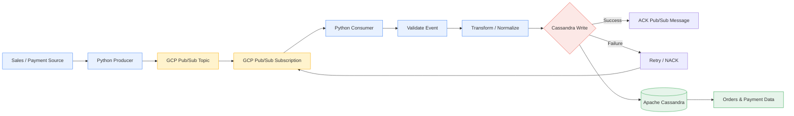
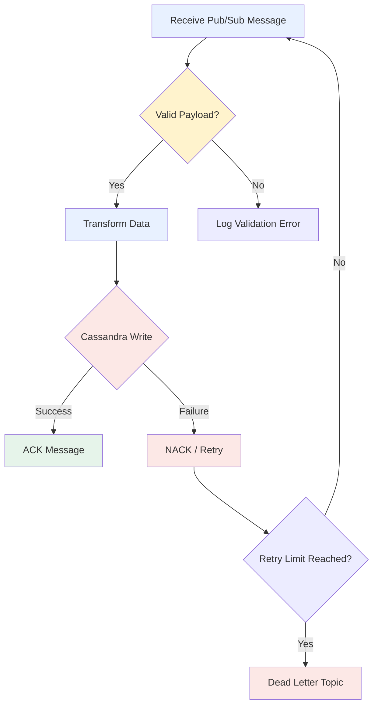
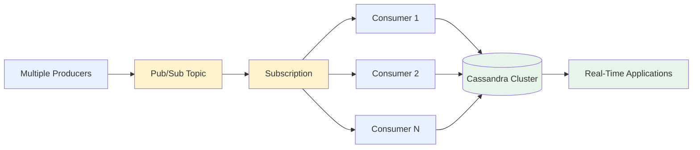

# Sales Order & Payment Data — Real-Time Ingestion

<p align="center">
  
  
  
  
</p>

<p align="center">
  <b> Real-Time Sales Order & Payment Data Ingestion Pipeline</b>
</p>

<p align="center">
  An event-driven data ingestion system that receives order and payment events through
  <b>Google Cloud Pub/Sub</b>, processes them with <b>Python</b>, and persists them in
  <b>Apache Cassandra</b>.
</p>

---

## 📌 Project at a Glance

| Item | Details |
|---|---|
| **Project** | Sales Order & Payment Data — Real-Time Ingestion |
| **Domain** | E-Commerce / Payments / Real-Time Data Engineering |
| **Architecture** | Event-Driven / Asynchronous |
| **Input** | Sales Order & Payment Events |
| **Message Broker** | Google Cloud Pub/Sub |
| **Processing** | Python |
| **Database** | Apache Cassandra |
| **Containerization** | Docker |
| **Data Format** | JSON |
| **Processing Mode** | Real-Time / Streaming |

---

## 🎯 Project Objective

The objective of this project is to build a **real-time, scalable and reliable data ingestion pipeline** for sales order and payment events.

Instead of waiting for batch jobs, every order/payment event is published to **Google Cloud Pub/Sub** and processed immediately by a Python consumer.

The processed data is then stored in **Apache Cassandra**, which is suitable for high-volume distributed writes and horizontally scalable workloads.

### Business Flow

```text
Customer places an order
          │
          ▼
Payment is processed
          │
          ▼
Order / Payment Event Generated
          │
          ▼
Google Cloud Pub/Sub
          │
          ▼
Python Consumer
          │
    ┌─────┴─────┐
    │           │
 Validate     Transform
    │           │
    └─────┬─────┘
          ▼
      Cassandra
          │
          ▼
 Real-Time Order & Payment Data
```

---

# 🏗️ System Architecture



### 🔄 End-to-End Data Flow

```text
┌──────────────────────┐
│  Sales / Payment     │
│       Source         │
└──────────┬───────────┘
           │
           │ JSON Event
           ▼
┌──────────────────────┐
│  Python Producer     │
│                      │
│  Create Event        │
│  Serialize JSON      │
└──────────┬───────────┘
           │
           ▼
┌──────────────────────┐
│   Google Cloud       │
│      Pub/Sub         │
│                      │
│      Topic           │
└──────────┬───────────┘
           │
           ▼
┌──────────────────────┐
│   Subscription       │
└──────────┬───────────┘
           │
           ▼
┌──────────────────────┐
│  Python Consumer     │
│                      │
│  1. Receive          │
│  2. Validate         │
│  3. Transform        │
│  4. Persist          │
└──────────┬───────────┘
           │
           ▼
┌──────────────────────┐
│      Cassandra       │
│      NoSQL DB        │
└──────────┬───────────┘
           │
           ▼
┌──────────────────────┐
│ Orders & Payments    │
│ Real-Time Data       │
└──────────────────────┘
```

---

# 🛠️ Tech Stack

| Technology | Role in Project | Why It Is Used |
|:---:|---|---|
| 🐍 **Python** | Producer & Consumer | Event processing, validation and transformation |
| ☁️ **GCP Pub/Sub** | Message Broker | Real-time asynchronous event ingestion |
| 🗄️ **Apache Cassandra** | NoSQL Database | Distributed storage and high write throughput |
| 🐳 **Docker** | Containerization | Consistent and portable deployment |
| 📦 **JSON** | Event Format | Lightweight structured event payload |
| 🧪 **Pytest** | Testing | Unit and integration testing |
| 🔧 **Git/GitHub** | Version Control | Source-code management and collaboration |

---

# 📂 Project Structure

```text
order-payment-realtime-ingestion/
│
├── producer/
│   ├── __init__.py
│   └── publisher.py
│
├── consumer/
│   ├── __init__.py
│   └── subscriber.py
│
├── database/
│   ├── __init__.py
│   ├── cassandra_client.py
│   └── queries.py
│
├── models/
│   ├── __init__.py
│   └── order_payment.py
│
├── config/
│   └── config.py
│
├── utils/
│   ├── logger.py
│   └── validation.py
│
├── tests/
│   ├── test_producer.py
│   ├── test_consumer.py
│   └── test_database.py
│
├── requirements.txt
├── Dockerfile
├── docker-compose.yml
├── .env.example
├── .gitignore
└── README.md
```

---

# 📩 Sample Order & Payment Event

```json
{
  "order_id": "ORD10001",
  "customer_id": "CUS5001",
  "product_id": "PROD101",
  "quantity": 2,
  "amount": 2499.99,
  "payment_method": "UPI",
  "payment_status": "SUCCESS",
  "order_status": "CONFIRMED",
  "timestamp": "2026-08-11T10:30:15Z"
}
```

---

# 🔄 Processing Pipeline

### Step 1 — Event Creation

The application creates an order/payment JSON event.

### Step 2 — Publish to Pub/Sub

The Python producer publishes the event to the Pub/Sub topic.

### Step 3 — Consume Event

The Python consumer listens to the Pub/Sub subscription.

### Step 4 — Validate

The consumer checks:

- Required fields
- Data types
- Order ID
- Payment status
- Amount
- Timestamp
- Payload format

### Step 5 — Transform

The event is normalized into the format required by Cassandra.

### Step 6 — Store

The validated event is inserted into Cassandra.

### Step 7 — Acknowledge

Only after successful persistence, the Pub/Sub message is acknowledged.

```text
Receive
   │
   ▼
Validate
   │
   ▼
Transform
   │
   ▼
Cassandra Write
   │
 ┌─┴──────────┐
 │            │
Success     Failure
 │            │
 ▼            ▼
ACK        NACK / Retry
```

---

# 🗄️ Cassandra Data Model

### Keyspace

```sql
CREATE KEYSPACE order_payment
WITH replication = {
    'class': 'SimpleStrategy',
    'replication_factor': 1
};
```

### Orders Table

```sql
CREATE TABLE order_payment.orders (
    order_id TEXT,
    customer_id TEXT,
    product_id TEXT,
    quantity INT,
    amount DECIMAL,
    payment_method TEXT,
    payment_status TEXT,
    order_status TEXT,
    event_timestamp TIMESTAMP,
    PRIMARY KEY (order_id)
);
```

> **Production note:** For a multi-node production Cassandra cluster, use `NetworkTopologyStrategy` and design partition/clustering keys according to actual query patterns and expected data volume.

---

# 🐍 Python Producer

Example publishing logic:

```python
from google.cloud import pubsub_v1
import json

publisher = pubsub_v1.PublisherClient()

project_id = "YOUR_GCP_PROJECT_ID"
topic_id = "order-payment-topic"

topic_path = publisher.topic_path(
    project_id,
    topic_id
)

event = {
    "order_id": "ORD10001",
    "amount": 2499.99,
    "payment_status": "SUCCESS"
}

data = json.dumps(event).encode("utf-8")

future = publisher.publish(topic_path, data)

print(f"Published message ID: {future.result()}")
```

---

# 📥 Python Consumer

Example subscriber:

```python
from google.cloud import pubsub_v1

subscriber = pubsub_v1.SubscriberClient()

project_id = "YOUR_GCP_PROJECT_ID"
subscription_id = "order-payment-subscription"

subscription_path = subscriber.subscription_path(
    project_id,
    subscription_id
)


def callback(message):

    try:
        data = message.data.decode("utf-8")

        # 1. Validate
        # 2. Transform
        # 3. Write to Cassandra

        message.ack()

    except Exception as error:

        print(f"Processing failed: {error}")

        message.nack()


streaming_pull_future = subscriber.subscribe(
    subscription_path,
    callback=callback
)

streaming_pull_future.result()
```

---

# ☁️ GCP Pub/Sub Setup

### Create Topic

```bash
gcloud pubsub topics create order-payment-topic
```

### Create Subscription

```bash
gcloud pubsub subscriptions create order-payment-subscription \
    --topic=order-payment-topic
```

### Publish Test Message

```bash
gcloud pubsub topics publish order-payment-topic \
    --message='{"order_id":"ORD10001","amount":2499.99,"payment_status":"SUCCESS"}'
```

### Pull Message

```bash
gcloud pubsub subscriptions pull order-payment-subscription \
    --auto-ack
```

---

# 🐳 Docker

### Dockerfile

```dockerfile
FROM python:3.11-slim

WORKDIR /app

COPY requirements.txt .

RUN pip install --no-cache-dir -r requirements.txt

COPY . .

CMD ["python", "-m", "consumer.subscriber"]
```

### Build

```bash
docker build -t order-payment-ingestion .
```

### Run

```bash
docker run --env-file .env order-payment-ingestion
```

---

# ⚙️ Environment Configuration

Create a `.env` file:

```env
GCP_PROJECT_ID=your-gcp-project-id

PUBSUB_TOPIC=order-payment-topic

PUBSUB_SUBSCRIPTION=order-payment-subscription

CASSANDRA_HOST=localhost

CASSANDRA_PORT=9042

CASSANDRA_KEYSPACE=order_payment

CASSANDRA_TABLE=orders
```

### 🔐 Security

Never commit:

```text
.env
*.json
service-account.json
private keys
passwords
API keys
```

Use Google Cloud IAM and a secure secret-management solution for production credentials.

---

# 📦 Installation

### 1. Clone Repository

```bash
git clone https://github.com/<YOUR_USERNAME>/order-payment-realtime-ingestion.git

cd order-payment-realtime-ingestion
```

### 2. Create Virtual Environment

```bash
python -m venv venv
```

### 3. Activate Environment

**Windows**

```bash
venv\Scripts\activate
```

**Linux / macOS**

```bash
source venv/bin/activate
```

### 4. Install Dependencies

```bash
pip install -r requirements.txt
```

---

# ▶️ Run the Application

### Start Cassandra

```bash
docker-compose up -d cassandra
```

### Start Consumer

```bash
python -m consumer.subscriber
```

### Start Producer

Open another terminal:

```bash
python -m producer.publisher
```

---

# 🔁 Reliability & Error Handling

The system is designed to avoid losing messages during processing failures.



### Recommended Production Features

- Pub/Sub retry policies
- Dead-letter topics
- Exponential backoff
- Idempotent processing
- Structured logging
- Cassandra replication
- Health checks
- Graceful shutdown
- Monitoring and alerting

---

# 📈 Scalability Architecture



The architecture can scale by increasing consumer instances and Cassandra nodes based on workload requirements.

---

# 🧪 Testing

Run:

```bash
pytest
```

Test coverage should include:

| Test Area | Example |
|---|---|
| Producer | Event creation and publishing |
| Consumer | Message processing |
| Validation | Invalid/missing fields |
| Cassandra | Insert operation |
| Error Handling | Retry/NACK behavior |
| Integration | Pub/Sub → Consumer → Cassandra |

---

# 📊 Observability

Important production metrics:

| Metric | Purpose |
|---|---|
| Message Throughput | Events processed per second |
| Processing Latency | Pub/Sub → Cassandra processing time |
| Error Rate | Failed processing percentage |
| Retry Count | Number of retried messages |
| Pub/Sub Backlog | Unprocessed messages |
| Cassandra Latency | Database operation latency |
| Consumer Health | Consumer service availability |

---

# 🔐 Production Security

Recommended controls:

- Google Cloud IAM with least-privilege access
- Secure secret management
- TLS for database connections
- Private networking where applicable
- No credentials in source code
- Separate Dev / QA / Production environments
- Audit logging
- Encryption in transit and at rest

---

# 🚀 Future Enhancements

- [ ] FastAPI monitoring APIs
- [ ] Pydantic event validation
- [ ] Pub/Sub Dead Letter Topic
- [ ] GitHub Actions CI/CD
- [ ] Google Cloud Run deployment
- [ ] GKE deployment
- [ ] Google Cloud Monitoring
- [ ] Grafana dashboards
- [ ] OpenTelemetry tracing
- [ ] Event schema versioning
- [ ] Data quality monitoring
- [ ] Automated integration testing
- [ ] Horizontal consumer scaling

---

# 💼 Real-World Use Cases

This architecture can be adapted for:

- 🛒 E-commerce order processing
- 💳 Payment transaction processing
- 🏪 Retail sales ingestion
- 📦 Inventory updates
- 🚚 Logistics and shipment tracking
- 📊 Real-time operational dashboards
- 💰 Financial transaction ingestion
- 👤 Customer activity tracking

---

# 🎓 Key Skills Demonstrated

```text
Python
   │
   ├── Event Processing
   ├── JSON
   ├── Validation
   └── Error Handling

GCP Pub/Sub
   │
   ├── Topics
   ├── Subscriptions
   ├── ACK / NACK
   └── Retry

Cassandra
   │
   ├── NoSQL
   ├── Data Modeling
   ├── Distributed Storage
   └── High-Volume Writes

Docker
   │
   ├── Containerization
   └── Deployment
```

---

# 🎤 Interview Explanation

### 30-Second Version

> **"I developed a real-time Sales Order and Payment Data ingestion pipeline using Python, Google Cloud Pub/Sub, Docker and Apache Cassandra. The producer publishes order and payment events to a Pub/Sub topic. A Python consumer receives the events, validates and transforms the payload, and stores the processed data in Cassandra. The message is acknowledged only after successful database persistence. For failures, the system uses NACK/retry mechanisms and can be extended with dead-letter topics. The architecture is event-driven, decoupled and horizontally scalable."**

### Architecture in One Line

```text
Producer → GCP Pub/Sub → Python Consumer → Validation/Transformation → Cassandra
```

---

# 👨‍💻 Author

**Your Name**

- GitHub: `https://github.com/<YOUR_USERNAME>`
- LinkedIn: `https://www.linkedin.com/in/<YOUR_LINKEDIN_USERNAME>/`

---

<p align="center">
  ⭐ If you find this project useful, please consider giving the repository a star!
</p>
